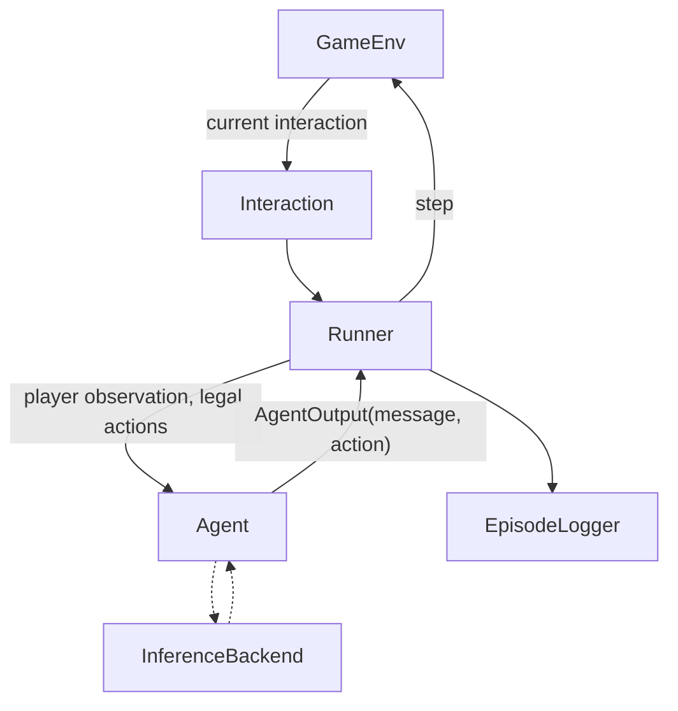

# SelfPlayWorlds

Common environments and infrastructure for multi-agent LLM self-play in strategic social games.

> One real game (Coup) works end-to-end, but the framework is not specific to that game. The environment exposes the current interaction structure, and the runner handles different patterns such as single actions, response windows, discussion, and eventually simultaneous actions. Coup is the first implementation because it tests more than a simple alternating-turn loop.

## Motivation

Games differ not only in their rules, but in **interaction structure**: who may act, and when.

| Pattern | Example |
|---|---|
| Single action | a player takes their turn |
| Reaction or challenge window | "Does anyone challenge Alice's Duke?" The first challenger closes the window |
| Open discussion | investigators argue about who the murderer is |
| Simultaneous actions | everyone votes or loads a bag without seeing the others |

A framework built around one `current_player` and an alternating loop cannot express the last three. Here, every decision point is an explicit `Interaction` with a mode, a game-specific phase, and the set of players who may act.

## Core design



- **GameEnv** is the source of truth: rules, hidden state, legal actions, observations, result. It never calls a model.
- **Interaction** says what is happening now: `phase` (game rule), `mode` (`SINGLE`, `RESPONSE_WINDOW`, `DISCUSSION`, `SIMULTANEOUS`), and who **may** act.
- **Runner** decides who is **asked first**, retries invalid answers, and contains no game rules.
- **Agent** sees only its own player's observation and returns a `message` and/or a structured `action`.
- **InferenceBackend** (mock, OpenRouter, vLLM) is used only by LLM agents. **EpisodeLogger** writes one JSON file per game.

Details: [`docs/architecture.md`](docs/architecture.md).

## Current status

**WORKING NOW**
- Coup end-to-end, 2 to 6 players, rules checked against two rulebook transcriptions ([`docs/coup-rules.md`](docs/coup-rules.md))
- `SINGLE` and `RESPONSE_WINDOW` interactions
- Scripted, random and LLM agents (LLM path run with the mock backend only)
- One JSON episode log per game, readable terminal trace, deterministic seeds
- 123 tests, no model, API key or GPU needed (one of them needs the optional `llm` extra)

**TEST-SUPPORTED** (proven with a test fixture, no real game yet)
- `DISCUSSION`
- `SIMULTANEOUS`

**DESIGNED / FUTURE**
- Sheriff of Nottingham, Deception, Pit, communication games ([`docs/game-format-matrix.md`](docs/game-format-matrix.md))
- Real-model evaluation through OpenRouter and vLLM on CARC ([`docs/carc-setup.md`](docs/carc-setup.md))
- RL integration (for example prime-rl) ([`docs/roadmap.md`](docs/roadmap.md))

## Quick start

Needs [uv](https://docs.astral.sh/uv/) and Python 3.11+.

```bash
uv sync
uv run pytest
uv run python examples/run_coup.py
```

Options: `--seed N`, `--players 2..6`, `--quiet`, `--full-state`, `--agents scripted|random|llm`.

Example trace (seed 0, the default):

```text
Turn 1: Carol (2 coins)
    Carol claims the Duke and takes Tax.
  [challenge_action] response window: Alice, Bob may respond
    Alice passes.
    Bob challenges Carol's claim to be the Duke.
    Carol reveals the Duke, shuffles it back and draws a new card. Bob loses the challenge.
    Bob loses an influence (lost a challenge) and reveals the Contessa.
    Carol now has 5 coins.

Turn 2: Alice (2 coins)
    Alice claims the Captain and tries to steal from Carol.
  ...
Result: Carol wins after 14 turns (seed 0).
Agent decisions: 33, forced moves applied automatically: 3, invalid outputs: 0.
Episode log: runs/coup-seed0-3p.json
```

A sample episode file is committed at [`examples/output/coup-seed0-3p.json`](examples/output/coup-seed0-3p.json).

### LLM agents (optional)

```bash
uv run python examples/run_coup.py --agents llm --backend mock            # whole LLM path, offline
export OPENROUTER_API_KEY=...                                             # never commit keys
uv run --extra llm python examples/run_coup.py --agents llm --backend openrouter --model <model-id>
uv run --extra llm python examples/run_coup.py --agents llm --backend vllm --model <served-model>   # VLLM_BASE_URL
```

## Adding a new game

1. Create `src/selfplay_worlds/games/<name>/` with an environment class that implements `GameEnv`.
2. Split each turn into phases and give each phase one of the four modes.
3. Write `observe()` so it returns only what that player may know, and test that it does.
4. Add a `GameSpec`: rules text and `render_observation` for LLM prompts, plus a simple scripted policy.
5. Register it in `games/__init__.py`; add rule tests and a random-agent stress test.

The Runner, agents, logger and inference code do not change for a game that uses the existing modes.

## Design principles

1. The environment is the source of truth.
2. Agents see only player-specific observations.
3. Interaction structure is explicit.
4. Message and structured action are separate.
5. Runner orchestration is independent of game rules.
6. Every episode can be serialized.
7. The inference backend is replaceable.
8. RL is a future consumer, not part of the core environment.

## Repository map

```text
src/selfplay_worlds/
  core/        GameEnv, Interaction, Runner, AgentOutput
  agents/      ScriptedAgent, RandomAgent, LLMAgent
  inference/   MockBackend, OpenRouterBackend, VLLMBackend
  episodes/    EpisodeLogger (JSON), TracePrinter (terminal)
  games/coup/  the Coup environment, rules text, prompts, scripted policy
examples/      run_coup.py and a sample episode
tests/         rule, runner, logging, LLM-path and stress tests; fixtures/ holds test-only environments
docs/          architecture, design decisions, Coup rules, game matrix, CARC setup, roadmap, progress, meeting notes
scripts/carc/  environment check and an example Slurm proxy for CARC
```

## Documents

| Read this | For |
|---|---|
| [`docs/progress.md`](docs/progress.md) | where the project stands |
| [`docs/architecture.md`](docs/architecture.md) | why the code looks the way it does |
| [`docs/design-decisions.md`](docs/design-decisions.md) | decisions, alternatives and tradeoffs |
| [`docs/meeting-demo.md`](docs/meeting-demo.md) | a 5-minute explanation and demo script |
| [`docs/references.md`](docs/references.md) | what was reviewed (no code reused) |
