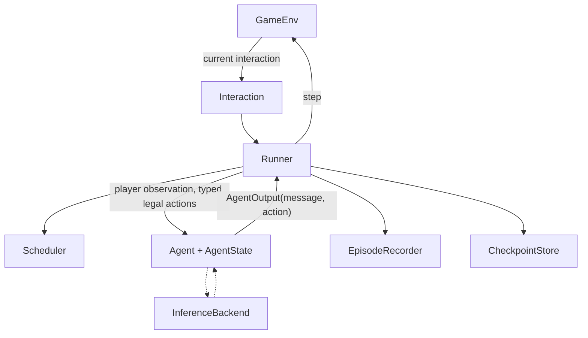

# SelfPlayWorlds

Common environments and infrastructure for multi-agent LLM self-play in strategic social games.

> One real game (Coup) works end-to-end, including a full three-player run with a real model through vLLM on CARC. The environment exposes the current interaction structure, and the runner supports single actions, response windows, discussion, and simultaneous actions. Coup is the first implementation because it tests more than a simple alternating-turn loop.

## Motivation

Games differ not only in their rules, but in **interaction structure**: who may act, and when.

| Pattern | Example |
|---|---|
| Single action | a player takes their turn |
| Reaction or challenge window | "Does anyone challenge Alice's Duke?" The first challenger closes the window |
| Open discussion | investigators argue about who the murderer is |
| Simultaneous actions | everyone votes or loads a bag without seeing the others |

A framework built around one `current_player` and an alternating loop cannot express the last three. Here, every decision point is an explicit `Interaction` with a mode, a game-specific phase, and the set of players who may act.

## Core design



- **CoupEnv** owns one serializable **CoupState** and is the source of truth for rules, hidden state, legal actions, observations, and the result. It never calls a model.
- **Interaction** says what is happening now: `phase` (game rule), `mode` (`SINGLE`, `RESPONSE_WINDOW`, `DISCUSSION`, `SIMULTANEOUS`), and who **may** act.
- **Scheduler** decides who is **asked first**. The default is deterministic round robin.
- **Runner** connects the components, retries invalid answers, and contains no game rules.
- **Agent** owns a serializable `AgentState`, sees only its own player's observation, and returns a `message` and/or a structured action.
- **InferenceBackend** (mock, OpenRouter, vLLM) is used only by LLM agents. **EpisodeRecorder** writes the research record. **CheckpointStore** writes recovery state separately.

Details: [`docs/architecture.md`](docs/architecture.md).

## Current status

**WORKING NOW**
- Coup end-to-end, 2 to 6 players, rules checked against two rulebook transcriptions ([`docs/coup-rules.md`](docs/coup-rules.md))
- `SINGLE` and `RESPONSE_WINDOW` interactions
- Scripted, random and LLM agents, including a real Qwen2.5-7B-Instruct run through vLLM on CARC
- One JSON episode log per game, readable terminal trace, deterministic seeds
- 135 tests, no model, API key or GPU needed (one is skipped without the optional `llm` extra)
- Typed Coup state, phases, and actions; per-agent state; usage budgets; atomic checkpoint and deterministic resume

**TEST-SUPPORTED** (proven with a test fixture, no real game yet)
- `DISCUSSION`
- `SIMULTANEOUS`

**DESIGNED / FUTURE**
- Sheriff of Nottingham, Deception, Pit, communication games ([`docs/game-format-matrix.md`](docs/game-format-matrix.md))
- A second real environment. Deception is a proposed candidate because it would exercise `DISCUSSION`, but it has not been selected or implemented
- RL integration (for example prime-rl) ([`docs/roadmap.md`](docs/roadmap.md))

### Real-model validation

On CARC, commit `9dcc33f7c5fc68ec03a8501221d0b8bbd8d58d83` completed one full three-player Coup episode with `Qwen/Qwen2.5-7B-Instruct` served by vLLM on one A40. Alice (`p0`) won after 5 turns. The run made 15 real model calls, recorded 18 accepted events and 3 forced moves, exercised challenge, block, and challenge-block phases, and produced 0 invalid outputs, retries, or fallbacks. Usage was 10,883 input tokens and 180 output tokens. The checkpoint and artifact validation both passed.

The original target, `google/gemma-4-31B-it`, is prepared for one A100 80 GB. CARC job `12558939` is currently pending for priority. This is not yet a claimed Gemma result.

## Quick start

Needs [uv](https://docs.astral.sh/uv/) and Python 3.11+.

```bash
uv sync
uv run pytest
uv run python examples/run_coup.py
```

Options: `--seed N`, `--players 2..6`, `--quiet`, `--full-state`, `--agents scripted|random|llm`.

Example trace (seed 0, the default):

```text
Turn 1: Carol (2 coins)
    Carol claims the Duke and takes Tax.
  [challenge_action] response window: Alice, Bob may respond
    Alice passes.
    Bob challenges Carol's claim to be the Duke.
    Carol reveals the Duke, shuffles it back and draws a new card. Bob loses the challenge.
    Bob loses an influence (lost a challenge) and reveals the Contessa.
    Carol now has 5 coins.

Turn 2: Alice (2 coins)
    Alice claims the Captain and tries to steal from Carol.
  ...
Result: Carol wins after 14 turns (seed 0).
Agent decisions: 33, forced moves applied automatically: 3, invalid outputs: 0.
Episode log: runs/coup-seed0-3p.json
```

A legacy schema 1.0 sample episode file is committed at [`examples/output/coup-seed0-3p.json`](examples/output/coup-seed0-3p.json). New runs use schema 2.0 and add aggregate inference usage.

### LLM agents (optional)

```bash
uv run python examples/run_coup.py --agents llm --backend mock            # whole LLM path, offline
export OPENROUTER_API_KEY=...                                             # never commit keys
uv run --extra llm python examples/run_coup.py --agents llm --backend openrouter --model <model-id>
uv run --extra llm python examples/run_coup.py --agents llm --backend vllm --model <served-model>   # VLLM_BASE_URL
uv run --extra llm python examples/run_coup.py --agents llm --backend vllm --model google/gemma-4-31B-it --structured-output
```

## Adding a new game

1. Create `src/selfplay_worlds/games/<name>/` with an environment class that implements `GameEnv`.
2. Split each turn into phases and give each phase one of the four modes.
3. Write `observe()` so it returns only what that player may know, and test that it does.
4. Add a `GameSpec`: rules text and `render_observation` for LLM prompts, plus a simple scripted policy.
5. Register it in `games/__init__.py`; add rule tests and a random-agent stress test.

The Runner, agents, logger and inference code do not change for a game that uses the existing modes.

## Design principles

1. The environment is the source of truth.
2. Agents see only player-specific observations.
3. Interaction structure is explicit.
4. Message and structured action are separate.
5. Scheduling is an experimental policy, separate from rules.
6. Runner orchestration is independent of game rules.
7. Episode records and recovery checkpoints have separate jobs.
8. The inference backend is replaceable and usage is explicit.
9. RL is a future consumer, not part of the core environment.

## Repository map

```text
src/selfplay_worlds/
  core/        GameEnv, Interaction, Scheduler, Runner, AgentOutput, DecisionEvent
  agents/      AgentState, ScriptedAgent, RandomAgent, LLMAgent
  inference/   backends, GenerationConfig, UsageTracker
  episodes/    EpisodeRecorder, CheckpointStore, TracePrinter
  games/coup/  CoupEnv, CoupState, CoupAction, rules, prompts, scripted policy
examples/      run_coup.py and a sample episode
tests/         rule, runner, logging, LLM-path and stress tests; fixtures/ holds test-only environments
docs/          architecture, design decisions, Coup rules, game matrix, CARC setup, roadmap, progress, meeting notes
scripts/carc/  environment check and an example Slurm proxy for CARC
```

## Documents

| Read this | For |
|---|---|
| [`docs/progress.md`](docs/progress.md) | where the project stands |
| [`docs/architecture.md`](docs/architecture.md) | why the code looks the way it does |
| [`docs/design-decisions.md`](docs/design-decisions.md) | decisions, alternatives and tradeoffs |
| [`docs/meeting-demo.md`](docs/meeting-demo.md) | a 5-minute explanation and demo script |
| [`docs/references.md`](docs/references.md) | what was reviewed (no code reused) |
| [`docs/repo-walkthrough.md`](docs/repo-walkthrough.md) | the architecture in simple questions and one exact call path |
| [`docs/dj-design-review.md`](docs/dj-design-review.md) | DJ's whiteboard concepts mapped directly to the implementation |
| [`docs/carc-gemma4-runbook.md`](docs/carc-gemma4-runbook.md) | validated launcher pattern and the current Gemma 4 CARC run |
