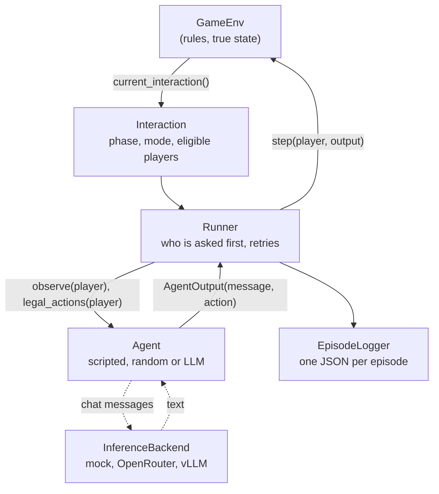
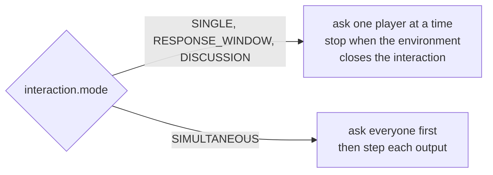
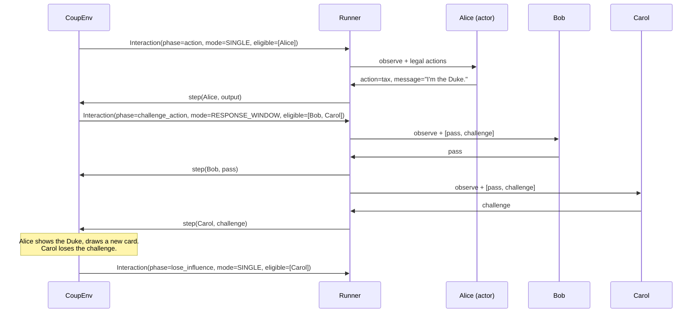
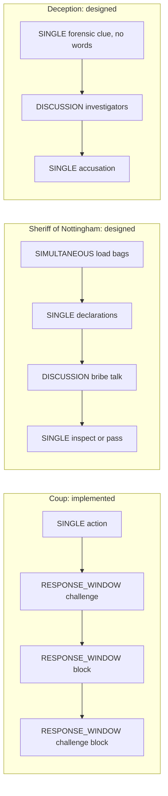

# Architecture

## The problem in one sentence

Games differ not only in their rules but in **who is allowed to act, and when**. A framework built around one `current_player` and an alternating loop cannot express a challenge window, an open discussion, or simultaneous moves.

## The main idea

> I implemented one real game end-to-end, but the framework is not specific to that game. The environment exposes the current interaction structure, and the runner handles different patterns such as single actions, response windows, discussion, and eventually simultaneous actions. Coup is the first implementation because it tests more than a simple alternating-turn loop.

## Design requirements

| Requirement | How it is met |
|---|---|
| Different games have different turn structures | Every decision point is an explicit `Interaction` with one of four modes |
| Rules and hidden state must be trustworthy | Only the environment holds the true state and decides legality |
| Agents must not see hidden information | Agents receive `observe(player)`, never `full_state()`; tested |
| Talk and moves must be comparable | `AgentOutput` keeps `message` and `action` apart |
| Testable without models, keys or GPUs | Seeded scripted and random agents; `MockBackend` |
| Every game can be analysed later | One versioned JSON file per episode |
| Small enough to explain in five minutes | Six components, one file each |

## Components

| Component | File | Responsible for | Never does |
|---|---|---|---|
| **GameEnv** | `core/env.py` | True state, rules, legal actions, player observations, transitions, result | Call a model; decide who is asked first |
| **Interaction** | `core/interaction.py` | Describes the open decision point: `phase`, `mode`, `eligible_players`, `message_policy` | Contain game logic |
| **Runner** | `core/runner.py` | Asks the environment what is open, asks eligible agents in some order, passes their outputs to `env.step`, retries invalid outputs | Contain game rules |
| **Agent** | `agents/` | Turns one player's observation into an `AgentOutput` (message and/or action) | See hidden state |
| **InferenceBackend** | `inference/` | Sends chat messages to a model, returns text and token counts | Know anything about games |
| **EpisodeLogger** | `episodes/log.py` | Records every step and the result as one JSON file | Change the game |

A game plugs in through one `GameSpec` (`core/env.py`): a constructor, a plain-language rules text, a function that renders an observation as prompt text, and a default scripted policy. `games/__init__.py` lists the known games.

## Overall architecture



Dotted arrows exist only for LLM agents. Scripted and random agents never touch the inference layer, which is why every test runs without a model, a network or a GPU.

## Environment vs Runner

```text
Environment answers:  WHO MAY act right now, and WHAT is legal?
Runner answers:       WHO DO WE ASK FIRST, and what happens if an answer is invalid?
```

Why the split matters: in a Coup challenge window, whoever is asked first and challenges closes the window for everyone else. Physical play has no fixed order, so the order is an **experimental choice**, not a rule. Because it lives in the Runner (`order_policy`), we can change it without touching any game code. `tests/test_runner.py::test_order_policy_changes_who_challenges_first` runs the same game with the reverse order and gets a different challenger.

## Mode vs phase

- **`mode`** is a framework concept. The Runner reads only the mode to decide how to schedule agents.
- **`phase`** is a game concept. It names the rule being applied, for example `challenge_block`. Logs and prompts show it; the Runner ignores it.

| Mode | Runner behaviour | Environment behaviour | Used by |
|---|---|---|---|
| `SINGLE` | ask the one eligible player | apply the action | Coup: `action`, `lose_influence`, `exchange` |
| `RESPONSE_WINDOW` | ask eligible players one at a time in the chosen order | remove players who pass; close the window at the first challenge or block | Coup: `challenge_action`, `block_action`, `challenge_block` |
| `DISCUSSION` | keep cycling through the order | accept messages; decide when the discussion is over | test fixture only |
| `SIMULTANEOUS` | ask **every** eligible agent first, then submit all outputs | keep submissions secret until everyone has acted | test fixture only |



The Runner notices that the environment closed an interaction through `interaction_id`, which increases every time a new interaction opens. This is how "the first challenge closes the window" works without the Runner knowing anything about challenges.

## Coup: the action lifecycle



The full phase table and flowchart are in `docs/coup-rules.md`.

## How other games would fit (designed, not implemented)



The same four modes cover all three; only the phases and rules change. Details in `docs/game-format-matrix.md`.

## Data flow of one decision

1. `env.current_interaction()` returns the open interaction, or `None` when the game is over.
2. The Runner orders the eligible players with `order_policy`.
3. For the next player still eligible: `env.observe(player)` and `env.legal_actions(player)`.
4. If exactly one action is legal and no message is required, the Runner applies it (`auto`). Otherwise it calls `agent.act(...)`.
5. `env.step(player, output)` returns `StepResult(accepted, error, public_events)`.
6. If rejected: the Runner asks the agent again with `feedback=error` (default 2 retries), then falls back to the first legal action (the most conservative one, for example `pass`).
7. Every attempt, accepted or not, goes to the EpisodeLogger and the optional trace printer.

## Message vs action

```text
message: "I'm the Duke. I'll take three coins."     <- free text, public, never validated as a move
action:  {"type": "tax"}                            <- structured, validated by the environment
```

- The environment checks only the action. The message goes into the public history as table talk.
- An agent may return an action only, a message only, or both. Coup needs an action at every decision; the discussion fixture accepts message-only turns.
- In Coup the claim is the action (`tax` claims the Duke), so a lie is visible by comparing the claim with the hidden cards in the full state. Saying "I have the Duke" in a message is not a claim.
- For communication games, where the message is the move, the environment can read `output.message` in `step`.

## Observation vs full state

| | `observe(player)` | `full_state()` |
|---|---|---|
| Who uses it | agents, prompts | tests, the episode log (only if enabled) |
| Hidden cards of other players | never (only counts) | yes |
| Court deck order | never | yes |
| Own hidden cards | yes | yes |

Tests check this two ways: the observation contains none of the god-view keys, and two games that differ only in other players' hidden cards produce identical observations and identical LLM prompts (`tests/test_coup_observation.py`, `tests/test_llm_agent.py`).

## Logging

One JSON file per episode, schema version `1.0` (`episodes/log.py`). Top level:

```text
schema_version, game, episode_id, created_at, seed,
config {env, runner, include_full_state},
players [{id, name, agent}],
initial_state {public, full_state or null},
events [ {index, kind, interaction, actor, player_observation, output, auto, fallback,
          attempt, accepted, error, public_events, full_state_after (optional)} ],
public_log [every public event as text],
result {winners, payoffs, termination_reason, num_events, num_agent_calls,
        num_invalid_outputs, final_public_state}
```

- `output` always keeps `message`, `action`, `raw_model_output` and `metadata` apart, so "what the agent said" and "what it did" can be compared later.
- `player_observation` is exactly what the acting player saw, so it contains that player's own cards. The log is a research record, not a public transcript.
- Rejected outputs are logged too (`accepted: false`), which makes format errors measurable.
- The public history is stored once (`public_log`); each event keeps only `history_length`.

Example: `examples/output/coup-seed0-3p.json`.

## Inference

`InferenceBackend.generate(messages=..., max_tokens=..., temperature=...)` is the whole interface.

| Backend | Where the model runs | Needs |
|---|---|---|
| `MockBackend` | nowhere; canned replies | nothing |
| `OpenRouterBackend` | OpenRouter's servers | `uv sync --extra llm`, `OPENROUTER_API_KEY` |
| `VLLMBackend` | a vLLM server you started (for example on a CARC GPU node) | `uv sync --extra llm`, `VLLM_BASE_URL` |

`LLMAgent` builds the prompt from the game's `rules_text` and `render_observation`, asks for `{"message": ..., "action": <number>}`, and parses the reply without guessing. Token counts, latency and parse errors go into the log.

## Extension points: adding a game

1. Create `games/<name>/` with an environment class that implements `GameEnv`.
2. Decide the phases and give each one a mode.
3. Write `observe()` so it contains only what that player may know, and test it.
4. Add a `GameSpec` (rules text, `render_observation`, a simple scripted policy).
5. Register it in `games/__init__.py` and add rule tests plus a stress test with `RandomAgent`.

No Runner, agent, logger or inference change is needed for a game that uses the existing four modes.

## Known limitations

- Only Coup is a real game. `DISCUSSION` and `SIMULTANEOUS` are exercised by a test fixture only.
- Messages are public. There are no private channels yet (Sheriff's bribes or team chats would need them).
- In Coup, talk is attached to decisions; players cannot speak out of turn.
- The Runner is sequential and synchronous. There is no batching or parallel inference.
- Scripted agents test the machinery, not strategy.
- CARC steps are documented but not yet run on CARC (`docs/carc-setup.md`).

## Example trace

`uv run python examples/run_coup.py` (seed 0), first two turns:

```text
    Game starts with 3 players. Carol goes first.

Turn 1: Carol (2 coins)
    Carol claims the Duke and takes Tax.
  [challenge_action] response window: Alice, Bob may respond
    Alice passes.
    Bob challenges Carol's claim to be the Duke.
    Carol reveals the Duke, shuffles it back and draws a new card. Bob loses the challenge.
    Bob loses an influence (lost a challenge) and reveals the Contessa.
    Carol now has 5 coins.

Turn 2: Alice (2 coins)
    Alice claims the Captain and tries to steal from Carol.
  [challenge_action] response window: Bob, Carol may respond
    Bob passes.
    Carol passes.
  [block_action] response window: Carol may respond
    Carol claims the Ambassador to block.
  [challenge_block] response window: Alice, Bob may respond
    Alice passes.
    Bob passes.
    The block stands. Alice's steal fails.
```
