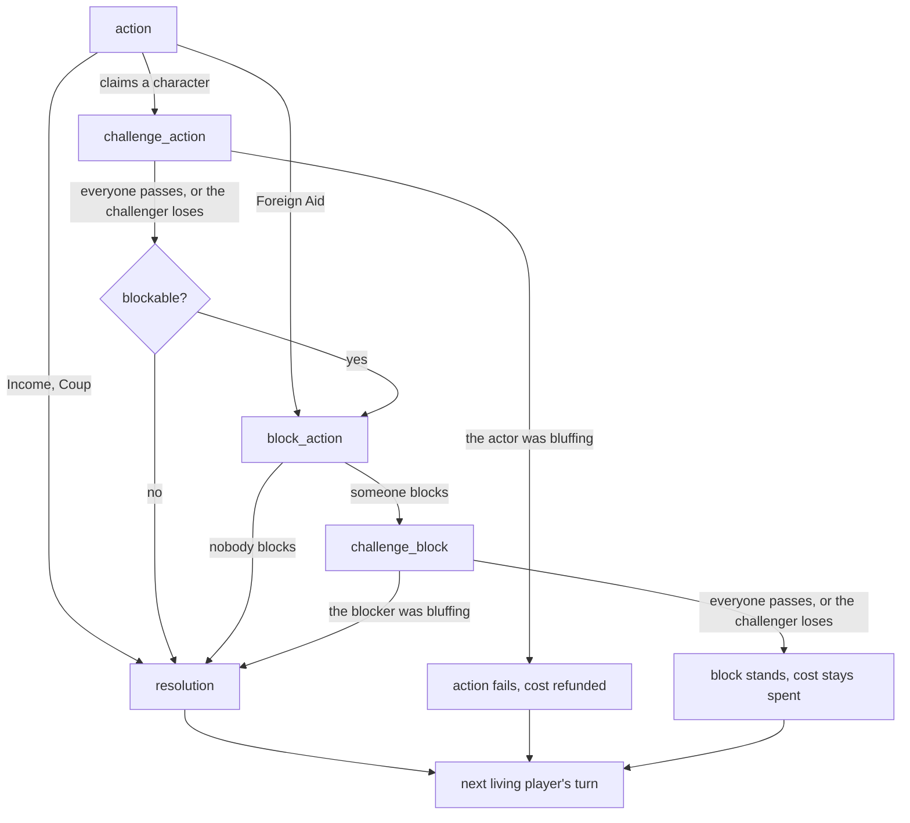

# Coup rules used by selfplay-worlds

Base game only (no Reformation, no expansions). 2 to 6 players.

## Sources

Two independent transcriptions of the official rulebook (designer Rikki Tahta). They agree on every rule below.

- 64 Oz. Games accessibility transcription: https://www.64ouncegames.com/pages/coup
- UltraBoardGames transcription: https://www.ultraboardgames.com/coup/game-rules.php

## Rules the engine implements

**Setup**
- 15 cards: 3 each of Duke, Assassin, Captain, Ambassador, Contessa.
- Each player gets 2 face-down cards and 2 coins. The rest of the cards form the Court deck. Coins are public.
- With 2 players, the starting player gets only 1 coin.

**Turn**
- Clockwise. Exactly one action per turn. A player may not pass.
- A player who starts the turn with 10 or more coins must launch a Coup.

**Actions**

| Action | Effect | Character claimed | Can be blocked by |
|---|---|---|---|
| Income | +1 coin | none | nobody |
| Foreign Aid | +2 coins | none | any player claiming the Duke |
| Coup | pay 7, target loses 1 influence | none | nobody |
| Tax | +3 coins | Duke | nobody |
| Assassinate | pay 3, target loses 1 influence | Assassin | the target, claiming the Contessa |
| Steal | take 2 from the target (1 if they have 1) | Captain | the target, claiming the Captain or the Ambassador |
| Exchange | draw 2 from the Court deck, keep as many cards as you had, return the rest | Ambassador | nobody |

**Challenges**
- Any action or block that claims a character can be challenged, by any other player, even one who is not involved.
- Challenges are resolved before blocks. A challenge cannot be made after play has moved on.
- The challenged player proves the claim by showing the card. If they cannot, they lose the challenge.
- Whoever loses the challenge loses 1 influence immediately.
- If the claimant wins, they shuffle the shown card back into the Court deck and draw a replacement. Then the action or block goes ahead.

**Coins after a failed action**
- Action successfully **challenged**: the action fails and **its cost is refunded**.
- Action successfully **blocked**: the action fails and **its cost stays spent**.
- So an Assassin caught bluffing gets the 3 coins back, but an assassination blocked by the Contessa does not.

**Losing influence and elimination**
- The player losing influence chooses which card to reveal. Revealed cards stay face up.
- A player with no face-down cards is out and returns all coins to the Treasury.
- A player can lose 2 influence in one assassination turn: a lost challenge plus the assassination, or a bluffed Contessa that is challenged plus the assassination.

**Talk**
- Negotiation is allowed but never binding. Players may not show cards to each other. Coins cannot be given or lent.

## How one turn becomes phases

The rulebook lets players "challenge or counteract" after an action, with challenges first. The engine turns this into explicit phases. Each phase is one `Interaction`:

| Phase | Mode | Who is eligible (environment order) | Legal actions |
|---|---|---|---|
| `action` | `SINGLE` | the current player | the actions they can afford; only Coup at 10+ coins |
| `challenge_action` | `RESPONSE_WINDOW` | every other living player, clockwise from the actor | `pass`, `challenge` |
| `block_action` | `RESPONSE_WINDOW` | Foreign Aid: every other living player. Steal, Assassinate: only the target | `pass`, `block` with each allowed character |
| `challenge_block` | `RESPONSE_WINDOW` | every living player except the blocker, clockwise from the blocker | `pass`, `challenge` |
| `lose_influence` | `SINGLE` | the player who must reveal a card | `reveal` one of their hidden cards |
| `exchange` | `SINGLE` | the Ambassador | `keep` one combination of cards |

Every lost challenge, Coup and assassination inserts a `lose_influence` phase before the turn continues. Exchange inserts an `exchange` phase during resolution.

Rules for response windows:
- A `pass` removes only that player from the window. The window closes when everyone has passed.
- The first `challenge` or `block` closes the window at once. Nobody else is asked.
- **Who is asked first is decided by the Runner**, not by the game. The default asks in the environment's order (clockwise from the actor). Changing the order changes who gets to challenge first (tested in `tests/test_runner.py`).

## Interpretation (not stated in the rulebook, chosen by us)

- **Serialised phases.** Because challenges come before blocks, a player who loses a challenge against an action may still block it afterwards, if they have influence left. The rulebook does not forbid this. Its "double danger" note only describes the case where they do not block. Test: `test_a_player_may_block_after_losing_a_challenge_against_the_same_action`.

## Simplifications (deliberate, documented)

- A challenged player who holds the claimed card always reveals it. The rules allow declining, but declining is almost never better, so it is not modelled.
- Talk is attached to decisions. A player can say something whenever they make a decision, including a pass. There is no free chat outside decisions; games where talk is the main activity use the `DISCUSSION` mode instead.
- The Treasury is treated as unlimited. The box has 50 coins, which normal play does not exhaust.
- The starting player is chosen by the seed. The rulebook says the winner of the previous game starts.
- The optional 2-player setup variant (card drafting) is not implemented. The basic 2-player rule (the starting player gets 1 coin) is.
- When a player has exactly one legal action (for example revealing their last card), the Runner applies it without asking the agent. It is logged with `"auto": true`.
- **Turn limit (not a rule).** A game that reaches 100 turns (`max_turns`) ends without a winner, with `termination_reason: "turn_limit"` and payoff 0 for everyone. Real Coup has no limit, but agents can repeat moves forever: two players whose only card is a Captain can steal from each other and block with the Captain indefinitely. In 2,000 scripted and random test games the longest game took 78 turns, so the limit only matters for looping agents.

## Where each rule is tested

| Rule | Test (in `tests/`) |
|---|---|
| Setup: 2 cards, 2 coins, 15-card deck | `test_coup_setup.py` |
| 2-player starting coin | `test_two_player_game_gives_the_starting_player_one_coin` |
| Costs, forced Coup at 10 coins | `test_coup_legality.py` |
| Challenge windows: order, first challenge closes | `test_claim_opens_a_response_window_for_everyone_else_in_seat_order`, `test_first_challenge_closes_the_window` |
| Failed and successful challenges, replacement card | `test_failed_challenge_costs_the_challenger_and_the_claimant_draws_a_new_card`, `test_successful_challenge_makes_the_action_fail` |
| Refund when challenged, no refund when blocked | `test_successfully_challenged_assassination_refunds_the_three_coins`, `test_blocked_assassination_keeps_the_three_coins_spent` |
| Who may block | `test_foreign_aid_can_be_blocked_by_any_other_player`, `test_only_the_target_may_block_a_steal` |
| Challenging a block | `test_challenging_a_true_block_costs_the_challenger_and_the_block_stands`, `test_challenging_a_bluffed_block_lets_the_action_resolve` |
| Double danger | `test_losing_a_challenge_then_being_assassinated_removes_two_influences`, `test_bluffed_contessa_that_is_challenged_loses_two_influences` |
| Elimination and winner | `test_eliminated_players_are_skipped_in_turns_and_response_windows`, `test_last_player_with_influence_wins` |
| Exchange | `test_exchange_draws_two_and_returns_two` |
| Hidden information | `test_coup_observation.py` |
| Turn limit | `test_turn_limit_ends_the_game_without_a_winner` |
| Invariants over 500 random and rule-based games (cards conserved, coins never negative, the eliminated never act) | `test_stress.py` |
